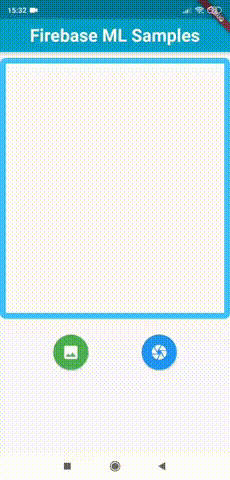

# Flutter - Firebase ML Samples

This project demonstrates how you can perform and deploy a machine learning algorithm on a mobile device using flutter framework and google firebase machine learning kit. 

In this repository, samples from the following ML algorithms are given:

- Face Contours Detection
- Image Labeling
- Text Recognition

### Requirements

- [Flutter](https://flutter.dev/) framework
- [Firebase](https://firebase.google.com/) 